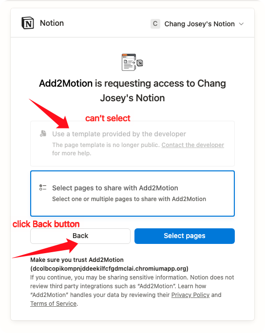
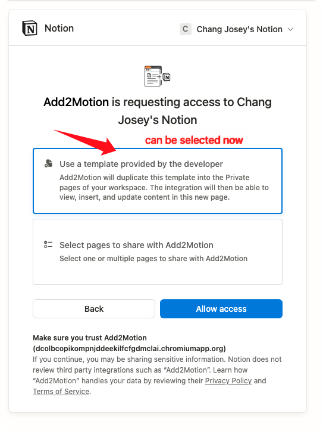

# Add to Notion FAQ

## Connect select "Use a template provided by the developer" option

### Method 1: Refresh Options
If you cannot select the "Use a template provided by the developer" option during Notion authorization, please try the following steps:
1. Click the "Back" button
2. Click the "Next" button again
3. You should now be able to see and select the option

### Method 2: Use Custom Template
If the above method doesn't work, you can alternatively:
1. Click the link below to clone the template to your Notion workspace
2. Select the second option on the authorization page
3. Choose the database you just cloned

[Click here to clone the template](https://www.notion.so/chatgptsave/15410052f0c88112ab78f0d450778eab?v=15410052f0c8811cb278000c2436dde5)

---

*If you encounter any issues during setup, please feel free to submit an Issue or contact our support team.*

